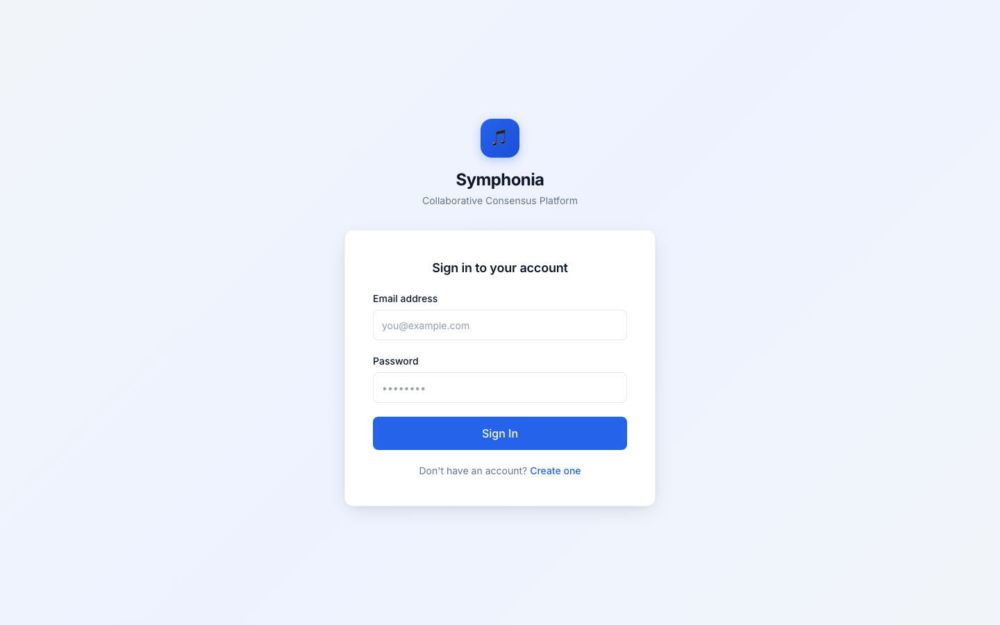
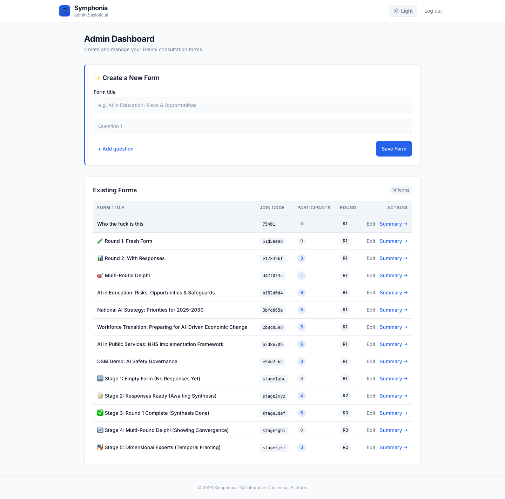
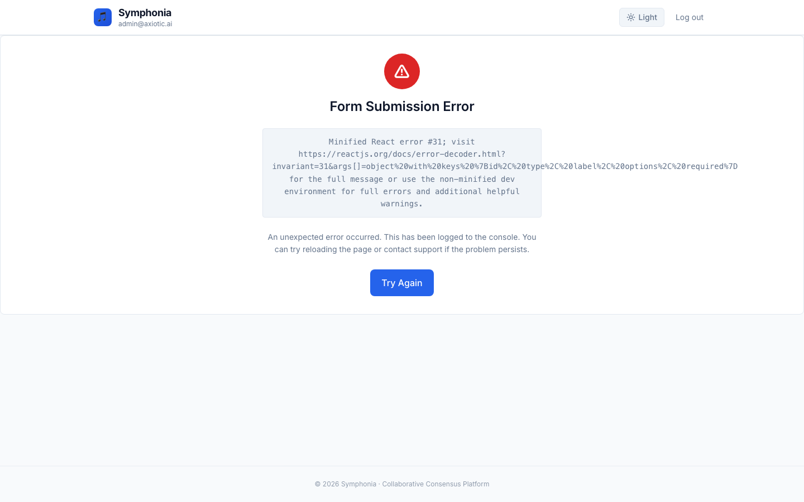
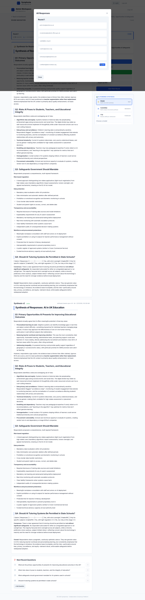
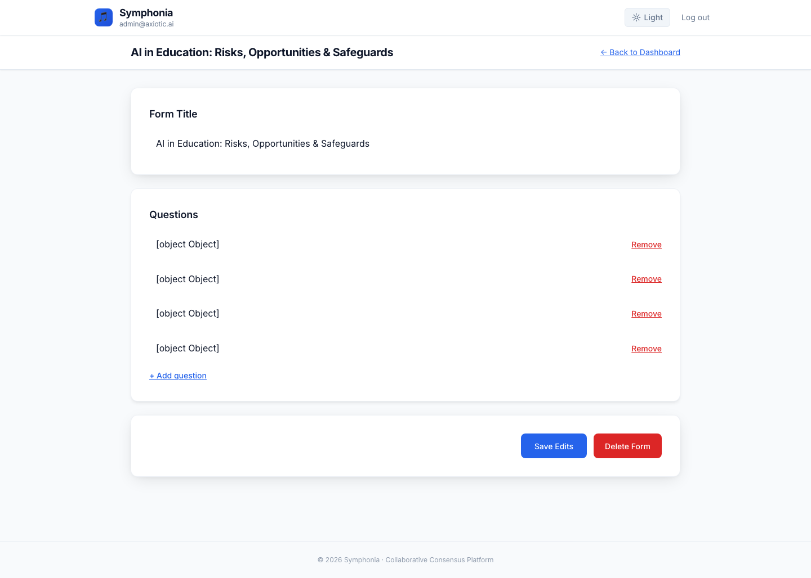

# Symphonia

**AI-powered expert consultation platform.** Run structured Delphi-style rounds with any group of experts — Symphonia collects their responses, lets them see each other's thinking, and uses AI to synthesise consensus, surface minority views, and generate the next round of questions automatically.

Built by [Axiotic AI](https://axiotic.ai).

---

## Screenshots

| Login | Dashboard | Form |
|---|---|---|
|  |  |  |

| Summary & AI Synthesis | Form Editor |
|---|---|
|  |  |

---

## Quickstart (Docker)

Three commands from zero to running:

```bash
git clone https://github.com/ruaridhmon/symphonia && cd symphonia
cp .env.example .env          # add your OPENROUTER_API_KEY
docker-compose up --build
```

Open **http://localhost:3000** — log in with the admin credentials you set in `.env`.

> **Need an OpenRouter key?** Get one at [openrouter.ai/keys](https://openrouter.ai/keys). The default model is Claude Sonnet 4.

---

## Features

**Delphi methodology**
- Multi-round structured consultation — each round builds on the last
- Real-time presence indicators (see who's online)
- Follow-up questions auto-generated from the previous round's synthesis

**AI synthesis engine**
- Powered by the [axiotic-ai/consensus](https://github.com/axiotic-ai/consensus) library
- Committee synthesis with multiple AI perspectives
- Diffusion-based iterative refinement
- Convergence scoring — know when experts actually agree

**Rich analysis**
- **Minority Report** — surfaces views the majority missed
- **Devil's Advocate** — strongest counterarguments to consensus
- **Emergence Highlights** — novel ideas that appeared across rounds
- **Consensus Heatmap** — visual agreement map across expert pool
- **Cross Matrix** — find where experts agree/disagree on each claim
- **Voice Mirroring** — rephrase synthesis in each expert's own style
- **Audience Translation** — rewrite for different audiences (policymakers, public, etc.)

**Admin tools**
- Form editor with multi-question support and custom expert labels
- Expert labelling presets: temporal, methodological, stakeholder, custom
- Synthesis version history with diff view
- Export synthesis as DOCX
- Audit log for all admin actions

**Security**
- CSRF protection (double-submit cookie)
- httpOnly session cookies + JWT
- Security response headers
- Cloudflare Access compatible

---

## Tech Stack

| Layer | Technology |
|---|---|
| Frontend | React 18, Vite, TypeScript, Tailwind CSS, Tiptap |
| Backend | Python, FastAPI, SQLAlchemy |
| Database | PostgreSQL 15 |
| AI | OpenRouter API + axiotic-ai/consensus |
| Real-time | WebSockets |
| Deployment | Docker Compose, Nginx |

---

## Project Structure

```
symphonia/
├── frontend/          # React/Vite SPA (TypeScript + Tailwind)
│   ├── src/
│   │   ├── components/    # UI components
│   │   ├── api/           # API client layer
│   │   ├── hooks/         # React hooks
│   │   └── layouts/       # Page layouts
│   └── Dockerfile
├── backend/           # FastAPI application
│   ├── core/
│   │   ├── models.py      # SQLAlchemy models
│   │   ├── routes.py      # API endpoints
│   │   ├── auth.py        # Authentication
│   │   ├── synthesis.py   # AI synthesis adapter
│   │   └── ws.py          # WebSocket manager
│   ├── main.py
│   └── Dockerfile
├── docs/              # Architecture and design docs
├── docker-compose.yml
└── .env.example
```

---

## Configuration

All configuration lives in a single `.env` file at the project root.

```bash
cp .env.example .env
```

| Variable | Required | Description |
|---|---|---|
| `OPENROUTER_API_KEY` | ✅ | Your OpenRouter API key |
| `DATABASE_URL` | ✅ | PostgreSQL connection string (pre-filled for Docker) |
| `VITE_API_BASE_URL` | ✅ | URL of the backend API (default: `http://localhost:8000`) |
| `ADMIN_EMAIL` | No | Admin account email (default: `admin@example.com`) |
| `ADMIN_PASSWORD` | No | Admin account password (default: `change-me-now`) |

> See [docs/INSTALLATION.md](docs/INSTALLATION.md) for the full configuration reference and non-Docker setup.

---

## Documentation

| Doc | Contents |
|---|---|
| [docs/INSTALLATION.md](docs/INSTALLATION.md) | Full install guide — Docker, local dev, config reference, troubleshooting |
| [docs/ARCHITECTURE.md](docs/ARCHITECTURE.md) | System architecture, data flow, security model |
| [docs/DESIGN.md](docs/DESIGN.md) | Design system and UI guidelines |
| [docs/FEATURES.md](docs/FEATURES.md) | Feature specifications |

---

## License

[MIT](LICENSE)
