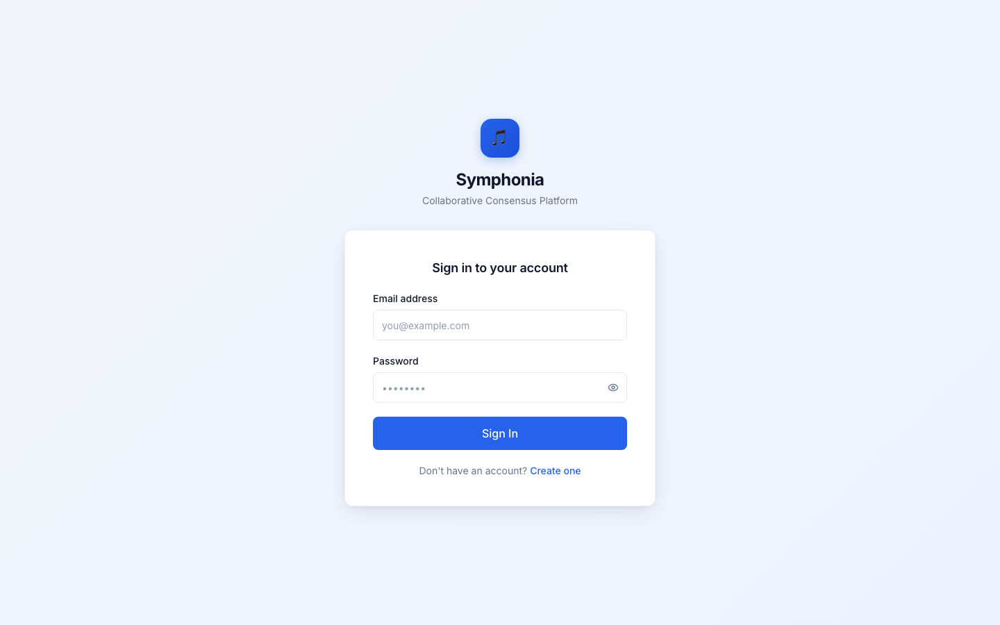
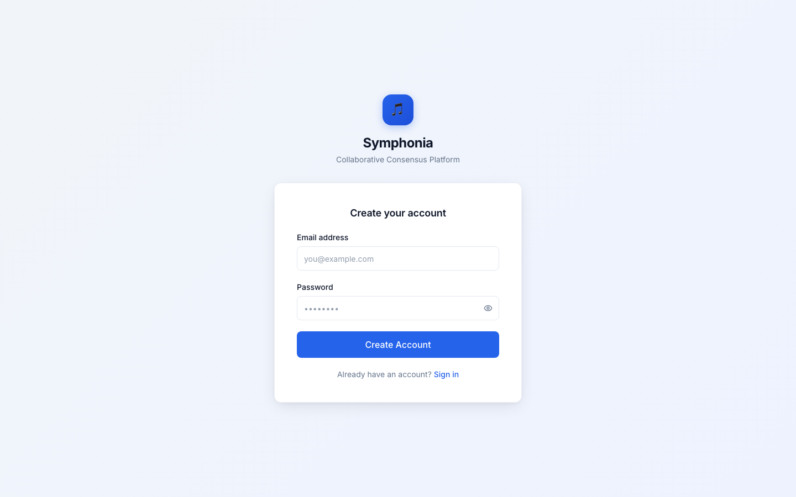
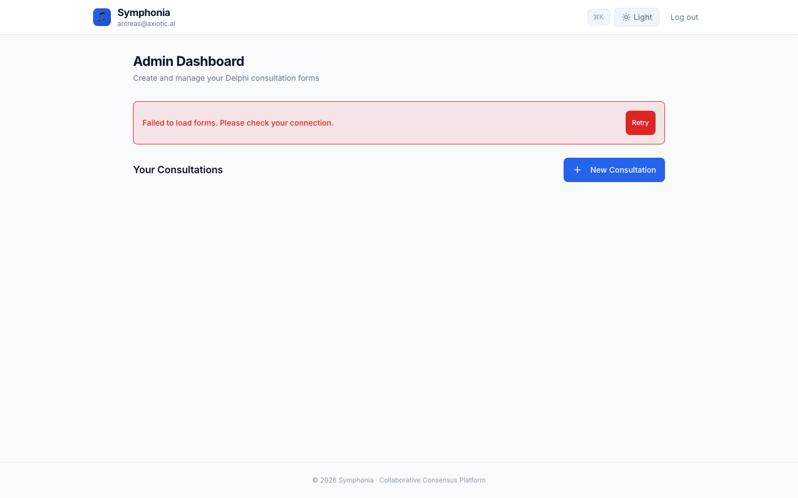
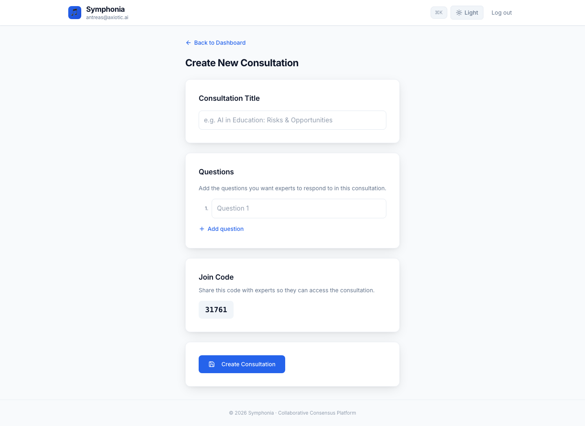
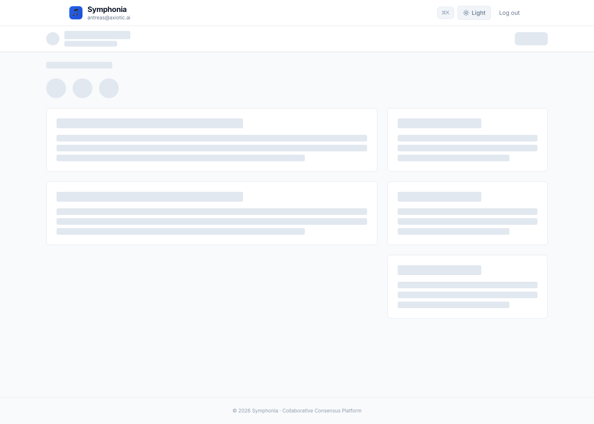
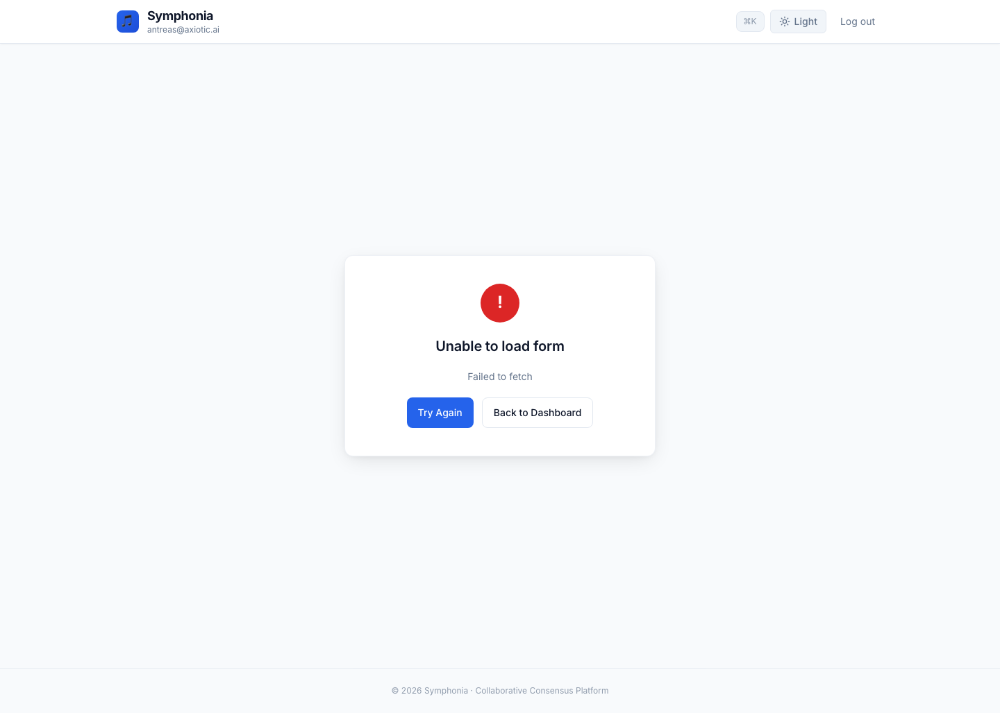

# Symphonia — Apple Design Specialist Review

> **Reviewer:** Senior Apple Design Specialist  
> **Date:** 2026-02-21  
> **Scope:** Full UI audit across 6 key pages  
> **Standard:** Apple Human Interface Guidelines (iOS 17+, macOS Sonoma+, iCloud web 2024+)

---

## Executive Summary

Symphonia has a **clean foundation** — good use of CSS custom properties, a token-based theme system, sensible component architecture, and reasonable accessibility considerations. However, under Apple HIG scrutiny, the UI reveals itself as a **Tailwind CSS / SaaS-generic skin** rather than a precision-crafted Apple-level experience. The issues are systemic, not cosmetic: wrong primary blue, tinted backgrounds where Apple uses neutrals, full-width buttons where Apple uses pills, redundant form labels, overly heavy typography weights, and missing polish details (empty states, skeleton hierarchy, focus rings).

**The good news:** Because Symphonia already uses CSS custom properties extensively, most fixes are token-level changes — not structural rewrites.

### Severity Key
- 🔴 **Critical** — Immediately breaks Apple design principles; fix first
- 🟠 **High** — Significant deviation; visible to any design-conscious user
- 🟡 **Medium** — Noticeable under scrutiny; affects perceived quality
- 🟢 **Polish** — Refinement-level; separates "good" from "Apple-quality"

---

## 1. Systemic Issues (All Pages)

These issues appear across every page and should be fixed globally.

### 🔴 1.1 — Primary Blue Is Wrong

**Current:** `--accent: #2563eb` (Tailwind blue-600)  
**Apple standard:** `#007AFF` (iOS system blue) or `#0071E3` (apple.com web blue)

The difference is meaningful: `#2563eb` is indigo-shifted (hue ≈225°), while Apple's blue is cleaner and slightly cyan-shifted (hue ≈211°). Users subconsciously associate `#007AFF` with "interactive element" across the Apple ecosystem. The Tailwind blue reads as generic SaaS.

**Fix:**
```css
:root {
  --accent: #007AFF;
  --accent-hover: #0062CC;
  --ring: #007AFF;
}
```

Also update all hardcoded `rgba(37, 99, 235, ...)` and `rgba(59, 130, 246, ...)` references throughout `index.css` to use `rgba(0, 122, 255, ...)`.

### 🔴 1.2 — Error Red Is Wrong

**Current:** `--destructive: #dc2626` (Tailwind red-600) — cool, aggressive  
**Apple standard:** `#FF3B30` (system red) — warmer, more approachable

```css
:root {
  --destructive: #FF3B30;
}
```

### 🔴 1.3 — Background Uses Tinted Gradient Instead of Neutral

**Current:**
```css
--background: #f1f5f9;
--background-gradient: linear-gradient(135deg, #f1f5f9 0%, #eef2ff 100%);
```

This lavender-blue wash is the single most immediately "non-Apple" element. Apple uses:
- `#FFFFFF` (pure white) for content backgrounds
- `#F2F2F7` (systemGroupedBackground) for grouped/card layouts
- **Never** a colored/tinted gradient for utility screens

**Fix:**
```css
:root {
  --background: #F2F2F7;
  --background-gradient: #F2F2F7;  /* No gradient */
}
```

### 🟠 1.4 — Font Weight Hierarchy Is Too Flat

The app uses essentially two weights: `700` (bold) for titles and `400` (regular) for everything else. Apple's type system uses a nuanced 5-step progression:

| Role | Apple Weight | Current |
|------|-------------|---------|
| Large Title | Semibold (600) or Bold (700) | Bold (700) ✓ but overused |
| Title 2/3 | Semibold (600) | Bold (700) ✗ too heavy |
| Headline / Section | Semibold (600) | Semibold (600) ✓ |
| Body | Regular (400) | Regular (400) ✓ |
| Caption / Labels | Regular (400) or Medium (500) | Medium (500) ✓ |

**Fix in `index.css`:**
```css
h1 { font-size: 1.875rem; font-weight: 700; letter-spacing: -0.025em; } /* Keep */
h2 { font-size: 1.5rem; font-weight: 600; } /* Was implicitly 600, explicit it */
h3 { font-size: 1.25rem; font-weight: 600; }
h4 { font-size: 1.125rem; font-weight: 600; }
```

### 🟠 1.5 — Border Radius Is Inconsistent and Slightly Small

**Current:** `--radius: 0.5rem` (8px)

Apple's current design language (iOS 17+, macOS Sonoma) uses **10–12px** for standard cards and inputs, **16–20px** for larger containers, and **full pill** for buttons.

**Fix:**
```css
:root {
  --radius: 0.75rem; /* 12px — matches Apple's current card/input radius */
}
```

### 🟠 1.6 — Font Stack Should Prioritize SF Pro

**Current:** `'Inter', -apple-system, BlinkMacSystemFont, 'Segoe UI', sans-serif`

Inter is a good fallback, but on Apple devices, the system font stack renders SF Pro — which is what Apple users expect. The font stack should put system fonts first, with Inter as fallback for non-Apple platforms.

**Fix:**
```css
:root {
  --font-family: -apple-system, BlinkMacSystemFont, 'SF Pro Text', 'SF Pro Display', 'Inter', 'Segoe UI', sans-serif;
}
```

### 🟡 1.7 — Card Shadow Is Single-Layer

**Current:**
```css
--card-shadow: 0 1px 3px 0 rgba(0,0,0,0.08), 0 1px 2px -1px rgba(0,0,0,0.06);
```

Apple uses multi-layered shadows for naturalistic depth. The current shadow is too subtle — cards barely lift off the page.

**Fix:**
```css
--card-shadow: 0 1px 2px rgba(0,0,0,0.04), 0 2px 8px rgba(0,0,0,0.06), 0 0 1px rgba(0,0,0,0.08);
--card-shadow-lg: 0 2px 4px rgba(0,0,0,0.04), 0 8px 24px -4px rgba(0,0,0,0.12), 0 0 1px rgba(0,0,0,0.1);
```

### 🟡 1.8 — Input Focus Ring Uses Wrong Blue and Is Too Subtle

**Current:**
```css
input:focus {
  box-shadow: 0 0 0 3px rgba(37, 99, 235, 0.12);
}
```

Apple's focus ring is more prominent: `0 0 0 4px rgba(0, 122, 255, 0.3)`.

**Fix:**
```css
input:focus,
textarea:focus,
select:focus {
  outline: none;
  border-color: #007AFF;
  box-shadow: 0 0 0 4px rgba(0, 122, 255, 0.25);
}
```

### 🟡 1.9 — Border Color Is Tailwind-Default

**Current:** `--border: #d1d5db` (Tailwind gray-300) — slightly warm  
**Apple:** `#D2D2D7` (separator) — perfectly neutral

```css
:root {
  --border: #D2D2D7;
  --input: #C7C7CC;
}
```

### 🟡 1.10 — Muted Foreground (Secondary Text) Should Match Apple's secondaryLabel

**Current:** `--muted-foreground: #64748b` (Tailwind slate-500)  
**Apple:** `#8E8E93` (secondaryLabel)

```css
:root {
  --muted-foreground: #8E8E93;
}
```

### 🟢 1.11 — Success Green Should Match Apple

**Current:** `--success: #16a34a`  
**Apple:** `#34C759` (systemGreen)

```css
:root {
  --success: #34C759;
}
```

---

## 2. Login Page (`/login`)

**Screenshot:** `screenshots/01-login.png`



### 🔴 2.1 — "Sign in to your account" Is Redundant

Apple's auth pages never state the obvious. iCloud.com says simply "Sign In" — or shows no heading at all, letting the context speak for itself.

**Fix in `Login.tsx`:**
```tsx
<h2 className="text-lg font-semibold text-center" style={{ color: 'var(--foreground)' }}>
  Sign In
</h2>
```

### 🔴 2.2 — Error Banner Uses Wrong Pattern

The red-background-with-red-text error banner is a Material/Tailwind convention. Apple presents errors either as:
1. **Inline field-level errors** (red text below the specific field)
2. **Alert dialogs** for critical errors
3. **A shake animation** on the affected field (iOS pattern)

Apple never uses a colored banner with destructive-colored text — that's low-contrast and visually aggressive.

**Fix in `Login.tsx`:** Replace the banner with inline error placement:
```tsx
{error && (
  <p
    className="text-sm text-center"
    role="alert"
    style={{ color: 'var(--destructive)' }}
  >
    {error}
  </p>
)}
```

No background color, no border. Just red text on white. Clean, Apple-like.

### 🟠 2.3 — Dual Labels (External Label + Placeholder) Are Redundant

Having both `<label>Email address</label>` above the input AND `placeholder="you@example.com"` inside is telling the user the same information twice. Apple uses either:
- **Placeholder-only** (iCloud web style) — placeholder serves as the label, animates on focus
- **Label-only** (Settings style) — left-aligned label in a grouped table row

**Recommended fix:** Remove the external label and rely on placeholder + floating label pattern. If keeping labels for accessibility (good practice), make them visually lighter:

```tsx
<label className="block text-xs font-normal" style={{ color: 'var(--muted-foreground)' }}>
  Email
</label>
```

Note: "Email" not "Email address" — Apple's copywriting is ruthlessly economical.

### 🟠 2.4 — Full-Width Button Should Be a Centered Pill

Apple's web CTAs (apple.com, iCloud) are **pill-shaped buttons** with generous horizontal padding, not full-width blocks. The full-width pattern is an iOS edge-to-edge convention that doesn't translate to desktop web.

**Fix in `Login.tsx`:**
```tsx
<LoadingButton
  type="submit"
  variant="accent"
  size="lg"
  loading={isLoggingIn || isLoading}
  loadingText="Signing in…"
  className="mx-auto"  /* Remove w-full, add mx-auto for centering */
>
  Sign In
</LoadingButton>
```

**Fix in `index.css` — add pill button variant:**
```css
.btn-interactive {
  border-radius: 980px; /* Full pill */
}
```

Or create a `.btn-pill` modifier:
```css
.btn-pill {
  border-radius: 980px;
  padding-left: 2rem;
  padding-right: 2rem;
}
```

### 🟠 2.5 — Bottom Text Is Too Conversational

**Current:** "Don't have an account? Create one"  
**Apple would say:** Just a standalone link: "Create Account"

The conversational "Don't have an account?" sentence is a Google/Material convention.

**Fix:**
```tsx
<div className="text-sm text-center" style={{ color: 'var(--muted-foreground)' }}>
  <Link to="/register" className="font-medium" style={{ color: 'var(--accent)' }}>
    Create Account
  </Link>
</div>
```

### 🟡 2.6 — App Icon Uses Emoji Instead of SVG

The `🎵` emoji in a gradient square is fine for a prototype but doesn't match Apple's icon standards. Apple app icons use carefully designed vector glyphs — not text emoji.

**Fix in `AuthLayout.tsx`:**
Replace the emoji with an SVG music note icon:
```tsx
<svg width="24" height="24" viewBox="0 0 24 24" fill="none" stroke="white" strokeWidth="2">
  <path d="M9 18V5l12-2v13" />
  <circle cx="6" cy="18" r="3" fill="white" />
  <circle cx="18" cy="16" r="3" fill="white" />
</svg>
```

### 🟡 2.7 — "Collaborative Consensus Platform" Subtitle Is Unnecessary

Apple products rarely have taglines on auth screens. The brand name alone should suffice. This subtitle adds visual noise without aiding the user's task (which is: sign in).

**Fix:** Remove the subtitle from `AuthLayout.tsx`, or reduce it to near-invisible:
```tsx
{/* Remove or greatly diminish */}
<p className="text-xs mt-1 opacity-50" style={{ color: 'var(--muted-foreground)' }}>
  Collaborative Consensus Platform
</p>
```

### 🟢 2.8 — Card Hover Effect Shouldn't Apply to Auth Cards

The `.card-lg:hover` rule adds `box-shadow: var(--card-shadow-lg)` on hover. On a static auth card, this hover elevation feels wrong — the card isn't an interactive element. Only clickable cards should elevate.

**Fix:** Add `pointer-events: none` or remove hover from auth cards specifically, or scope the hover to `.card-interactive` only.

---

## 3. Register Page (`/register`)

**Screenshot:** `screenshots/02-register.png`



Same structural issues as login — they share `AuthLayout`. Specific additional issues:

### 🟠 3.1 — "Create your account" Should Be Simply "Register" or "Create Account"

Same redundancy issue. Apple keeps it short.

### 🟡 3.2 — No Password Strength Indicator

Apple's account creation flow always includes a password strength meter or requirement list. Without it, users submit weak passwords and hit server-side validation errors. This is a UX and security gap.

**Fix:** Add a subtle password strength indicator below the password field:
```tsx
<div className="h-1 rounded-full mt-1.5" style={{
  backgroundColor: 'var(--muted)',
  overflow: 'hidden'
}}>
  <div
    className="h-full rounded-full transition-all duration-300"
    style={{
      width: `${strengthPercent}%`,
      backgroundColor: strengthColor
    }}
  />
</div>
```

---

## 4. Dashboard (`/`)

**Screenshot:** `screenshots/04-dashboard.png`



*(Note: Screenshot shows the authenticated dashboard with mock auth. API calls fail so the error state is visible.)*

### 🔴 4.1 — Error Banner Uses Destructive Red for a Non-Destructive Action

The error banner ("Failed to load forms") with a red "Retry" button violates a core Apple principle: **red is reserved for destructive actions** (Delete, Remove). "Retry" is a constructive recovery action — it should use the primary accent blue.

**Fix in `AdminDashboard.tsx`:**
```tsx
{error && (
  <div
    className="rounded-xl p-4 mb-6 flex items-center justify-between gap-3"
    style={{
      backgroundColor: 'var(--muted)',
      border: '1px solid var(--border)',
    }}
  >
    <div className="flex items-center gap-3">
      <span style={{ color: 'var(--destructive)', fontSize: '1.25rem' }}>⚠</span>
      <span className="text-sm" style={{ color: 'var(--foreground)' }}>{error}</span>
    </div>
    <LoadingButton variant="accent" size="sm" onClick={fetchForms}>
      Retry
    </LoadingButton>
  </div>
)}
```

Note: neutral background, normal text color, leading icon, accent (blue) retry button.

### 🔴 4.2 — No Empty State

When the consultations list is empty (or hasn't loaded), the page shows a vast white void below "Your Consultations". Apple **always** provides an empty state: a centered illustration or SF Symbol, a headline, a description, and a call to action.

**Fix — add below the header section:**
```tsx
{forms.length === 0 && !error && (
  <div className="text-center py-16">
    <div className="text-4xl mb-4 opacity-40">📋</div>
    <h3 className="text-lg font-semibold mb-1" style={{ color: 'var(--foreground)' }}>
      No Consultations Yet
    </h3>
    <p className="text-sm mb-6" style={{ color: 'var(--muted-foreground)' }}>
      Create your first consultation to get started.
    </p>
    <Link to="/admin/form/new">
      <LoadingButton variant="accent" size="md">
        <Plus size={18} className="mr-1.5" />
        New Consultation
      </LoadingButton>
    </Link>
  </div>
)}
```

### 🟠 4.3 — Table Header Uses UPPERCASE TRACKING

**Current:** `text-xs font-semibold uppercase tracking-wider` on table headers

Apple's table/list headers in modern macOS and iOS use **sentence case, small size, regular weight** — not loud uppercase with wide tracking. The uppercase screaming is a Bootstrap/Material convention.

**Fix:**
```tsx
<th className="p-3 text-xs font-medium text-left" style={{ color: 'var(--muted-foreground)' }}>
  Form Title
</th>
```

Remove `uppercase` and `tracking-wider`.

### 🟠 4.4 — "Admin Dashboard" Title Is Too Heavy

`text-2xl font-bold tracking-tight` produces a heavy title that dominates the page. Apple's page titles at this scale use semibold.

**Fix:**
```tsx
<h1 className="text-2xl font-semibold tracking-tight" style={{ color: 'var(--foreground)' }}>
  Dashboard
</h1>
```

Also: Apple wouldn't say "Admin Dashboard" — just "Dashboard". The user knows they're an admin.

### 🟡 4.5 — Header "Log out" Has No Button Affordance

"Log out" as plain text violates Apple's principle that actions should look tappable. It should either be inside a profile dropdown menu (Apple's preferred pattern) or styled as a clear secondary button.

**Fix in `Header.tsx`:** Either:
1. Wrap in a user avatar dropdown menu (recommended), or
2. Style as a visible secondary button

### 🟡 4.6 — Header Email Below Brand Name Conflates Identity With Navigation

Apple separates branding and user identity. The brand name goes in the navigation bar; the user's identity goes in a profile avatar/menu (top-right). Having `antreas@axiotic.ai` as a subtitle under "Symphonia" is a novel but non-standard conflation.

**Fix:** Move email to a profile avatar or user menu. Keep the header branding clean: just icon + "Symphonia".

### 🟢 4.7 — Footer Copyright Opacity

The footer at `opacity: 0.7` is unnecessarily dim. Apple's footers are readable but understated — use the muted-foreground color directly without additional opacity reduction.

---

## 5. Create Consultation (`/admin/form/new`)

**Screenshot:** `screenshots/05-form-new.png`



### 🔴 5.1 — Back Navigation Uses Inline Text Link Instead of Toolbar Button

**Current in `FormEditor.tsx`:**
```tsx
<button className="inline-flex items-center gap-1.5 text-sm font-medium mb-6" style={{ color: 'var(--accent)' }}>
  <ArrowLeft size={16} />
  Back to Dashboard
</button>
```

Apple places navigation controls in the navigation region (toolbar/header), not floating as body content. This conflates navigation with content and breaks the structural hierarchy.

**Fix:** Either:
1. Add a back button to the header component when on sub-pages
2. Or use a proper breadcrumb row in a sticky sub-header

If keeping inline, at minimum use Apple's chevron (not arrow) and just the destination name:
```tsx
<button className="...">
  <ChevronLeft size={16} />
  Dashboard
</button>
```

### 🟠 5.2 — Section Titles Inside Cards Are Too Heavy

`text-lg font-semibold` for "Consultation Title", "Questions", "Join Code" creates visually dominant labels for simple single-field sections. When a card contains one field, Apple uses a lighter label weight.

**Fix:** For single-field cards, use `text-sm font-medium`:
```tsx
<h2 className="text-sm font-medium mb-3 uppercase tracking-wide" 
    style={{ color: 'var(--muted-foreground)', letterSpacing: '0.05em' }}>
  Title
</h2>
```

### 🟠 5.3 — Save Icon Uses Floppy Disk (💾 / Save Icon)

The `<Save>` Lucide icon is a floppy disk. Apple hasn't used floppy disk iconography since the 1990s. For a primary form action, Apple uses either:
- No icon (text-only button)
- A checkmark icon (`checkmark.circle`)

**Fix:**
```tsx
<LoadingButton variant="accent" loading={saving} onClick={saveForm}>
  {isCreateMode ? 'Create Consultation' : 'Save Changes'}
</LoadingButton>
```

Remove the icon entirely. Apple's form submit buttons are text-only.

### 🟠 5.4 — Join Code Has No Copy Action

The join code (`31761`) is displayed in a muted badge with no obvious way to copy it. This is a key piece of information users need to share. Apple would include a copy button with confirmation feedback.

**Fix:**
```tsx
<div className="inline-flex items-center gap-3 px-4 py-2.5 rounded-xl bg-muted">
  <span className="font-mono text-lg font-semibold text-foreground">{joinCode}</span>
  <button onClick={() => copyToClipboard(joinCode)} title="Copy code">
    <Copy size={16} style={{ color: 'var(--muted-foreground)' }} />
  </button>
</div>
```

### 🟡 5.5 — Action Buttons in Their Own Card Creates False Separation

Wrapping the submit/delete buttons in a separate `card-lg` creates visual separation between the form content and its actions. Apple keeps primary actions connected to their form context — either as the last element in the last section, or as a sticky bottom bar.

**Fix:** Remove the card wrapper from the actions section, or merge it with the last section (Join Code).

### 🟡 5.6 — "+ Add question" Uses Text Plus Instead of Icon

**Current:** `<Plus size={16} /> Add question` as a blue text link

**Apple pattern:** A row with a green `plus.circle.fill` leading icon (see Contacts "add phone", Reminders "add item"). Or at minimum, a tappable list row styled as an add action.

### 🟡 5.7 — Number Prefix "1." Alignment

The `1.` text prefix left of the question input isn't baseline-aligned with the input text. The `width: 1.5rem` container and `text-align: right` is close but the vertical centering with `items-center` doesn't optically match the input's text baseline.

**Fix:** Use `items-baseline` instead of `items-center` on the flex container, or use `padding-top` to manually align.

---

## 6. Synthesis Workspace (`/admin/form/14/summary`)

**Screenshot:** `screenshots/06-summary.png`



*(Note: Shows skeleton loading state because API is unreachable locally.)*

### 🟠 6.1 — Skeleton Loading Lacks Hierarchy Differentiation

All skeleton bars are the same height and opacity. Apple's skeleton states differentiate heading vs. body through:
- Different heights (heading: 20px, body: 12px)
- Different opacities (heading: 15%, body: 10%)
- Different widths (heading: 40-60%, body: 80-100%)

**Fix in `SummaryLoadingSkeleton.tsx`:** Ensure heading skeletons are taller and slightly more opaque.

### 🟠 6.2 — Avatar Group Lacks Border Rings

The overlapping avatar circles have no white border/ring separating them. Apple's grouped avatars (Messages, Shared With You) always have a 2px white stroke around each circle to maintain individual identity.

**Fix:** Add `border: 2px solid var(--card)` to each avatar circle.

### 🟡 6.3 — Asymmetric Grid Creates Unbalanced Layout

The 2-column layout with left cards ~60% and right cards ~35% creates uneven visual mass when content density is similar. The bottom row having only a right-column card leaves a void on the left.

**Apple principle:** Visual mass should be balanced. If left and right contain similar content density, use equal columns (50/50) or a single-column layout.

### 🟡 6.4 — Cards Use Border-Only Without Shadow (Inconsistent)

The skeleton cards use `border: 1px solid var(--border)` with no shadow, while the error state card (see page 6) uses shadow with no border. This is a system-level inconsistency. Cards should use a unified treatment across the app.

**Fix:** All cards should use the same base `.card` class. Ensure `--card-shadow` is applied consistently.

### 🟢 6.5 — Skeleton Animation Should Use Gradient Shimmer

**Current:** The skeleton uses `skeleton-pulse` (opacity pulsing between two background colors).

**Apple standard:** A gradient shimmer that sweeps left-to-right, indicating loading activity more clearly.

**Fix in `index.css`:**
```css
@keyframes skeleton-shimmer {
  0% { background-position: -200% 0; }
  100% { background-position: 200% 0; }
}

.skeleton {
  background: linear-gradient(
    90deg,
    var(--skeleton-base) 25%,
    var(--skeleton-highlight) 50%,
    var(--skeleton-base) 75%
  );
  background-size: 200% 100%;
  animation: skeleton-shimmer 1.5s ease-in-out infinite;
}
```

---

## 7. Expert Response Form (`/form/14`)

**Screenshot:** `screenshots/07-form-14.png`



*(Shows error state: "Unable to load form" / "Failed to fetch")*

### 🔴 7.1 — "Failed to fetch" Exposes Raw Technical Error

**Current in `FormPage.tsx`:**
```tsx
<p className="text-sm text-muted-foreground">{loadError}</p>
```

Where `loadError` is set to `err.message` — which for network failures is the raw `Failed to fetch` string from the Fetch API.

Apple's HIG explicitly states: *"Don't display raw error codes or technical jargon."*

**Fix:** Map technical errors to human-friendly messages:
```tsx
const friendlyError = loadError?.includes('fetch')
  ? 'Check your internet connection and try again.'
  : loadError;
```

### 🔴 7.2 — Error Icon Uses Wrong Pattern

The error state renders a hand-crafted `<div>` styled as a red circle with "!" text. This is crude compared to Apple's SF Symbols approach.

**Fix:** Use a proper icon component or SVG:
```tsx
<div style={{
  width: '48px',
  height: '48px',
  display: 'flex',
  alignItems: 'center',
  justifyContent: 'center',
  margin: '0 auto',
}}>
  <AlertCircle size={48} style={{ color: 'var(--destructive)' }} />
</div>
```

Or better yet, use the Lucide `AlertTriangle` for warnings and `XCircle` for failures — matching Apple's semantic distinction.

### 🟠 7.3 — "Back to Dashboard" Secondary Button Uses Bordered Style

**Current:** The secondary button uses `variant="ghost"` which renders as `border: 1px solid var(--border)`.

Apple's secondary actions in error states are **text-only links in accent blue**, not bordered buttons. The bordered-but-unfilled button is a Bootstrap/Material convention.

**Fix:**
```tsx
<button
  onClick={() => navigate('/')}
  className="text-sm font-medium"
  style={{ color: 'var(--accent)', background: 'none', border: 'none' }}
>
  Go Back
</button>
```

### 🟠 7.4 — Error State Lacks Back Navigation in Chrome

An expert arriving at a broken form has no navigation affordance in the header/toolbar — only buttons inside the error card. Apple mandates persistent navigation regardless of content state.

### 🟡 7.5 — Button Text Is Too Long

"Back to Dashboard" is verbose. Apple prefers brevity: "Go Back" or just "Dashboard".

### 🟡 7.6 — Two Buttons Have Different Widths

The "Try Again" and "Back to Dashboard" buttons auto-size to their label width, creating visual asymmetry. Apple's error dialogs use **equal-width buttons** (or stacked full-width for mobile).

**Fix:** Set both buttons to the same minimum width:
```tsx
<div className="flex gap-3 justify-center">
  <LoadingButton style={{ minWidth: '140px' }}>Try Again</LoadingButton>
  <LoadingButton style={{ minWidth: '140px' }}>Go Back</LoadingButton>
</div>
```

---

## 8. Global Component Issues

### 🟠 8.1 — Button Hover Effect Uses `translateY(-1px)` + Shadow

**Current:**
```css
.btn-interactive:hover:not(:disabled) {
  transform: translateY(-1px);
  box-shadow: 0 4px 12px rgba(0, 0, 0, 0.15);
  filter: brightness(1.08);
}
```

Apple buttons **do not float up on hover**. This is a Material Design 3 convention (elevated → more elevated). Apple's hover state is a simple **background color darkening** — no translation, no shadow change, no brightness filter.

**Fix:**
```css
.btn-interactive:hover:not(:disabled) {
  filter: brightness(0.92);
}

.btn-interactive:active:not(:disabled) {
  filter: brightness(0.85);
  transform: scale(0.98);
  transition-duration: 0.06s;
}
```

### 🟠 8.2 — Card Hover Adds Elevation Change

**Current:**
```css
.card-lg:hover {
  box-shadow: var(--card-shadow-lg);
}

.card-interactive:hover {
  transform: translateY(-2px);
  border-color: var(--accent);
}
```

Non-interactive cards (like the auth card, form sections) should not change on hover. Only clickable cards should have a hover state. The `translateY(-2px)` lift is, again, Material Design — Apple cards darken slightly or show a subtle border change.

**Fix:** Remove hover from `.card-lg`. Only apply to `.card-interactive`:
```css
.card-interactive:hover {
  border-color: var(--accent);
  box-shadow: var(--card-shadow-lg);
}
```

No `translateY`.

### 🟡 8.3 — LoadingButton Spinner Is CSS-Only

The spinning border approach (`.spinner { border: 2px solid currentColor; border-right-color: transparent; }`) is functional but looks crude compared to Apple's activity indicator. Apple uses either:
- A multi-segment circular spinner (like UIActivityIndicatorView)
- A clean SVG spinner

For web, a clean SVG approach is better:
```css
.spinner {
  width: 1em;
  height: 1em;
  animation: spin 0.8s linear infinite;
}
```

### 🟡 8.4 — Toast Notifications Slide from Right

**Current:** `translateX(100%)` slide-in from the right edge.

Apple's notification pattern (macOS notification center) slides in from the top-right. For web toast patterns, Apple's Music web app and iCloud use a subtle **top-center** slide-down.

### 🟢 8.5 — Scrollbar Styling

The custom scrollbar styling (6px width, muted thumb) is a nice touch that approximates macOS behavior. However, the opacity values (0.3, 0.5) create very faint scrollbars that may be hard to find. Apple's scrollbars auto-hide but are clearly visible when actively scrolling.

---

## 9. Typography Specifics

### 🟡 9.1 — Line Height Is Generous Throughout

**Current:** `body { line-height: 1.6 }`, headings at `1.25`

Apple's SF Pro is designed for `line-height: 1.2` on headings and `1.47` on body text. The `1.6` body line-height creates excessive vertical space that makes text blocks feel airy and loose — the opposite of Apple's compact, information-dense approach.

**Fix:**
```css
body {
  line-height: 1.47;
}
```

### 🟡 9.2 — Letter Spacing on Headings

**Current:** `h1 { letter-spacing: -0.025em }`, others at `-0.01em`

Apple's SF Pro Display already has built-in optical tracking that tightens at larger sizes. The `-0.025em` on h1 is close to Apple's approach, but the `-0.01em` on other headings is too loose. For display sizes (h1-h3), use `-0.02em` to `-0.025em`.

---

## 10. Consolidated CSS Custom Properties Fix

Here is the complete set of token-level changes that would bring Symphonia significantly closer to Apple standards:

```css
:root {
  /* --- Surfaces (Apple system colors) --- */
  --background: #F2F2F7;
  --background-gradient: #F2F2F7;
  --foreground: #000000;
  --card: #FFFFFF;
  --card-foreground: #000000;
  --card-shadow: 0 1px 2px rgba(0,0,0,0.04), 0 2px 8px rgba(0,0,0,0.06), 0 0 1px rgba(0,0,0,0.08);
  --card-shadow-lg: 0 2px 4px rgba(0,0,0,0.04), 0 8px 24px -4px rgba(0,0,0,0.12), 0 0 1px rgba(0,0,0,0.1);

  /* --- Semantic surfaces --- */
  --secondary: #F2F2F7;
  --secondary-foreground: #000000;
  --muted: #F2F2F7;
  --muted-foreground: #8E8E93;

  /* --- Brand / accent (Apple system blue) --- */
  --accent: #007AFF;
  --accent-foreground: #FFFFFF;
  --accent-hover: #0062CC;

  /* --- Status (Apple system colors) --- */
  --destructive: #FF3B30;
  --destructive-foreground: #FFFFFF;
  --success: #34C759;

  /* --- Chrome --- */
  --border: #D2D2D7;
  --input: #C7C7CC;
  --ring: #007AFF;
  --radius: 0.75rem; /* 12px */
  --font-family: -apple-system, BlinkMacSystemFont, 'SF Pro Text', 'Inter', 'Segoe UI', sans-serif;
}
```

---

## Priority Implementation Order

### Phase 1 — Token-Level Fixes (1 hour, massive impact)
1. Update `:root` CSS custom properties to Apple colors (Section 10)
2. Update all hardcoded `rgba(37, 99, 235, ...)` references in `index.css`
3. Change `--radius` to `0.75rem`
4. Update `--font-family` stack

### Phase 2 — Component Fixes (2-3 hours)
5. Fix button hover to use brightness instead of translate (8.1)
6. Remove card hover from non-interactive cards (8.2)
7. Fix error banners across all pages (2.2, 4.1)
8. Fix "Sign in to your account" → "Sign In" (2.1)
9. Add empty state to dashboard (4.2)
10. Fix "Failed to fetch" error copy (7.1)

### Phase 3 — Structural Improvements (4-6 hours)
11. Convert full-width buttons to centered pills (2.4)
12. Remove redundant form labels or make them lighter (2.3)
13. Move back navigation to toolbar/header (5.1)
14. Add copy action to join code (5.4)
15. Fix skeleton loading hierarchy and shimmer (6.1, 6.5)
16. Add password strength indicator to register (3.2)

### Phase 4 — Polish (ongoing)
17. Replace emoji icon with SVG (2.6)
18. Refine typography weights across all pages (1.4)
19. Implement equal-width error buttons (7.6)
20. Header profile menu redesign (4.5, 4.6)
21. Audit all interactive elements for hover/focus/active states

---

## Summary Scorecard

| Dimension | Current | Target | Priority |
|-----------|---------|--------|----------|
| Color System | 4/10 | 9/10 | Token swap — Phase 1 |
| Typography | 5/10 | 8/10 | Weight + size fixes — Phase 2-3 |
| Spacing & Layout | 6/10 | 8/10 | Grid discipline — Phase 3 |
| Component Styling | 5/10 | 8/10 | Button/card/input fixes — Phase 2 |
| Error Handling | 3/10 | 8/10 | Pattern redesign — Phase 2 |
| Empty States | 2/10 | 8/10 | New components — Phase 2 |
| Micro-interactions | 4/10 | 7/10 | Hover/active refinement — Phase 2-3 |
| Visual Polish | 4/10 | 8/10 | Skeleton/icon/animation — Phase 3-4 |

**Overall: 4.1/10 → Target 8.1/10**

The path from current to Apple-quality is mostly token-level changes (colors, radii, fonts) combined with targeted component adjustments. The architecture is sound — it just needs to trade its Tailwind defaults for Apple-calibrated values.
